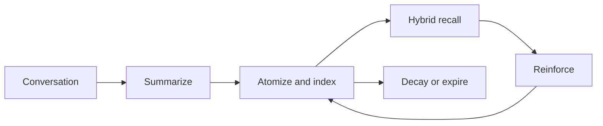

<a href="README.md">中文</a> &nbsp;/&nbsp; <strong>English</strong> &nbsp;/&nbsp; <a href="README_ru.md">Русский</a>

<h1>Anamnesis</h1>

<strong>Long-term memory for AstrBot that recalls with precision and evolves with every conversation.</strong>

CAPTURE &nbsp;&nbsp; RETRIEVE &nbsp;&nbsp; CONNECT &nbsp;&nbsp; EVOLVE

  
  
  
  

> **About this project**: Anamnesis 3.0.0 is an independent, renamed fork of [`astrbot_plugin_livingmemory`](https://github.com/lxfight-s-Astrbot-Plugins/astrbot_plugin_livingmemory) v2.6.1, maintained by Whereis-Alice. It is not affiliated with the upstream project or its author lxfight, and it is not maintained by upstream. See [NOTICE](NOTICE) for derivation and licensing, and [CHANGELOG_upstream.md](CHANGELOG_upstream.md) for the upstream history.

## Memory, with structure

<table>
<tr>
<td width="33%"><strong>PRECISE RECALL</strong>  BM25 and vector search run across document and graph routes, then converge through ranked fusion.</td>
<td width="33%"><strong>LIVING CONTEXT</strong>  Facts become independent memory atoms with importance, TTL, reinforcement, and temporal decay.</td>
<td width="33%"><strong>VISIBLE SCALE</strong>  Explore the complete relationship graph through a responsive canvas with communities and level of detail.</td>
</tr>
</table>

## One memory system

| Recall | Intelligence | Control |
| :--- | :--- | :--- |
| **Hybrid retrieval** Keyword and semantic search across two routes. | **Dual summaries** Facts and persona context remain independently useful. | **Safe operations** Backups, transactional deletion, and rebuild rollback. |
| **Agent-native tools** `anamnesis_recall_memory` and `anamnesis_memorize_memory`. | **Temporal graph** Confidence evolves as evidence accumulates or fades. | **Focused dashboard** Manage memory, debug recall, and inspect the full graph. |

## Recent capabilities

| Recoverable memory | Controlled boundaries | Online maintenance |
| :--- | :--- | :--- |
| **Sources and archives** Important memories can retain source messages for review and re-summarization; low-value memories can be archived and restored instead of deleted. | **Scopes and access control** Share memory by session, user, or globally, with explicit isolation, allowlists, and identity aliases. | **Safe index rebuilds** Startup checks and large repairs run in the background with batching, progress status, rollback, and shadow-index cutover. |

## Start in three moves

1. Install the plugin from the AstrBot plugin marketplace, or place it in `data/plugins`.
2. Reload AstrBot and open the Anamnesis configuration page.
3. Select the providers below; everything else has practical defaults.

| Setting | Purpose |
| :--- | :--- |
| `embedding_provider_id` | Embedding model; leave empty to use the AstrBot default. |
| `llm_provider_id` | Summarization model; leave empty to use the AstrBot default. |

Open the visual workspace at `Plugins -> Anamnesis -> Pages -> dashboard`. Plugin Pages requires **AstrBot 4.24.2 or later**.

## Go deeper

| Learn | Configure | Operate | Understand |
| :--- | :--- | :--- | :--- |
| [Quick start](docs/en/guide/getting-started.md) [Feature overview](docs/en/features.md) | [Configuration](docs/en/configuration.md) | [Commands](docs/en/commands.md) [WebUI guide](docs/en/webui.md) | [Architecture](docs/en/architecture.md) |

## Migrating from LivingMemory

The data directory changed with the plugin id, so memories from the old plugin are not picked up automatically. Run these steps in order:

1. Install and enable Anamnesis, then configure the providers above.
2. `/anam migrate preview` lists the files and sizes that would be migrated and writes nothing.
3. `/anam migrate exec` performs the migration; the old `backups/` directory is skipped to save disk space.
4. `/anam migrate-verify` compares row counts for documents, memory_atoms, graph_entries, graph_edges, graph_nodes, and conversations against the old database.
5. Uninstall the old plugin in AstrBot only after the verification looks correct.

Migration reads the old data directory only. It never modifies or deletes anything belonging to the old plugin, so you can safely roll back until you uninstall it.

## Project

[Documentation](docs/en/) · [Releases](https://github.com/Whereis-Alice/astrbot_plugin_anamnesis/releases) · [Changelog](CHANGELOG.md) · [Upstream history](CHANGELOG_upstream.md) · [Issues](https://github.com/Whereis-Alice/astrbot_plugin_anamnesis/issues)

Anamnesis is released under the [AGPL-3.0 license](LICENSE).
