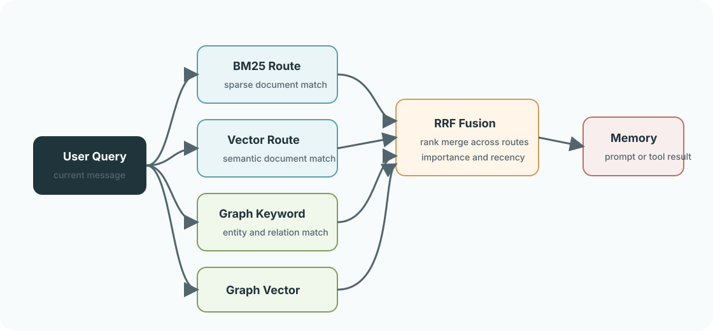
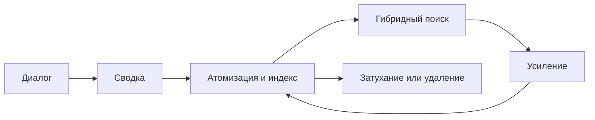

<a href="README.md">中文</a> &nbsp;/&nbsp; <a href="README_en.md">English</a> &nbsp;/&nbsp; <strong>Русский</strong>

<h1>Anamnesis</h1>

<strong>Долговременная память для AstrBot: точное извлечение и развитие с каждым диалогом.</strong>

СОХРАНЯТЬ &nbsp;&nbsp; ИЗВЛЕКАТЬ &nbsp;&nbsp; СВЯЗЫВАТЬ &nbsp;&nbsp; РАЗВИВАТЬ

  
  
  
  

> **О проекте**: Anamnesis 3.0.0 — независимый переименованный форк плагина [`astrbot_plugin_livingmemory`](https://github.com/lxfight-s-Astrbot-Plugins/astrbot_plugin_livingmemory) v2.6.1, поддерживаемый Whereis-Alice. Проект не связан с оригинальным репозиторием и его автором lxfight и не поддерживается ими. Сведения о происхождении и лицензии см. в [NOTICE](NOTICE), историю оригинального проекта — в [CHANGELOG_upstream.md](CHANGELOG_upstream.md).

## Память приобретает структуру

<table>
<tr>
<td width="33%"><strong>ТОЧНОЕ ИЗВЛЕЧЕНИЕ</strong>  BM25 и векторный поиск работают с документами и графом, а затем объединяют результаты в единый рейтинг.</td>
<td width="33%"><strong>ЖИВОЙ КОНТЕКСТ</strong>  Факты становятся независимыми атомами памяти с важностью, TTL, усилением и временным затуханием.</td>
<td width="33%"><strong>МАСШТАБ БЕЗ СКРЫТЫХ ДАННЫХ</strong>  Полный граф связей доступен на производительном холсте с сообществами и уровнями детализации.</td>
</tr>
</table>

## Единая система памяти

| Извлечение | Интеллект | Управление |
| :--- | :--- | :--- |
| **Гибридный поиск** Ключевые слова и семантика в двух контурах. | **Два вида сводок** Факты и контекст личности сохраняют отдельную ценность. | **Безопасные операции** Резервные копии, транзакционное удаление и откат. |
| **Инструменты для Agent** `anamnesis_recall_memory` и `anamnesis_memorize_memory`. | **Временной граф** Достоверность связей меняется по мере накопления и затухания свидетельств. | **Сфокусированная панель** Управление памятью, отладка поиска и просмотр полного графа. |

## Новые возможности

| Восстанавливаемая память | Управляемые границы | Обслуживание без остановки |
| :--- | :--- | :--- |
| **Исходные сообщения и архив** Для важных воспоминаний можно сохранить исходные сообщения, проверить их и повторно создать сводку; малоценные записи можно архивировать и восстанавливать. | **Области и контроль доступа** Память можно разделять по диалогу, пользователю или глобально, используя принудительную изоляцию, белые списки и псевдонимы. | **Безопасная перестройка индексов** Проверки и крупные исправления выполняются в фоне с пакетной обработкой, отображением прогресса, откатом и теневыми индексами. |

## Три шага для запуска

1. Установите плагин из каталога AstrBot или поместите его в `data/plugins`.
2. Перезапустите AstrBot и откройте страницу настроек Anamnesis.
3. Выберите два провайдера ниже; для остальных параметров заданы практичные значения.

| Параметр | Назначение |
| :--- | :--- |
| `embedding_provider_id` | Модель эмбеддингов; пустое значение использует стандартную модель AstrBot. |
| `llm_provider_id` | Модель для сводок; пустое значение использует стандартную модель AstrBot. |

Визуальная рабочая область: `Plugins -> Anamnesis -> Pages -> dashboard`. Для Plugin Pages нужен **AstrBot 4.24.2 или новее**.

## Подробнее

| Начало работы | Настройка | Команды | Архитектура |
| :--- | :--- | :--- | :--- |
| [Краткое руководство](docs/en/guide/getting-started.md) [Обзор функций](docs/en/features.md) | [Конфигурация](docs/en/configuration.md) | [Список команд](docs/en/commands.md) [Руководство WebUI](docs/en/webui.md) | [Устройство системы](docs/en/architecture.md) |

## Переход с LivingMemory

Каталог данных изменился вместе с идентификатором плагина, поэтому воспоминания старого плагина не подхватываются автоматически. Выполните шаги по порядку:

1. Установите и включите Anamnesis, затем настройте провайдеров, указанных выше.
2. `/anam migrate preview` покажет список файлов и их размер без какой-либо записи данных.
3. `/anam migrate exec` выполнит перенос; старый каталог `backups/` пропускается для экономии места.
4. `/anam migrate-verify` сверит количество строк в documents, memory_atoms, graph_entries, graph_edges, graph_nodes и conversations со старой базой.
5. Удаляйте старый плагин в AstrBot только после успешной сверки.

Перенос выполняется только для чтения старого каталога: данные старого плагина не изменяются и не удаляются, поэтому до его удаления всегда можно безопасно откатиться.

## Проект

[Документация](docs/en/) · [Релизы](https://github.com/Whereis-Alice/astrbot_plugin_anamnesis/releases) · [История изменений](CHANGELOG.md) · [История оригинального проекта](CHANGELOG_upstream.md) · [Сообщить о проблеме](https://github.com/Whereis-Alice/astrbot_plugin_anamnesis/issues)

Anamnesis распространяется по [лицензии AGPL-3.0](LICENSE).
